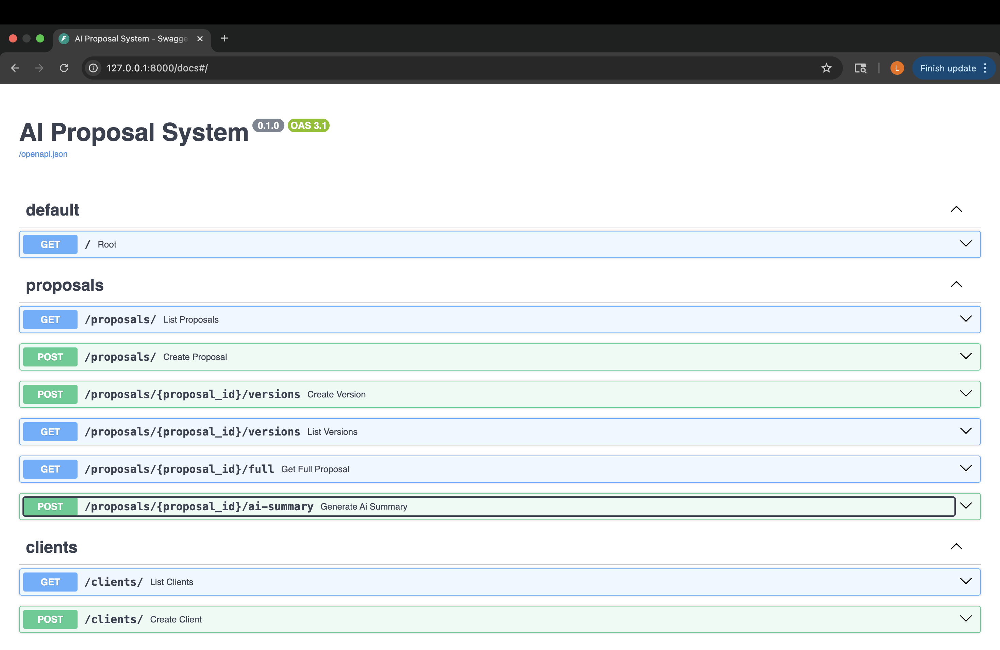
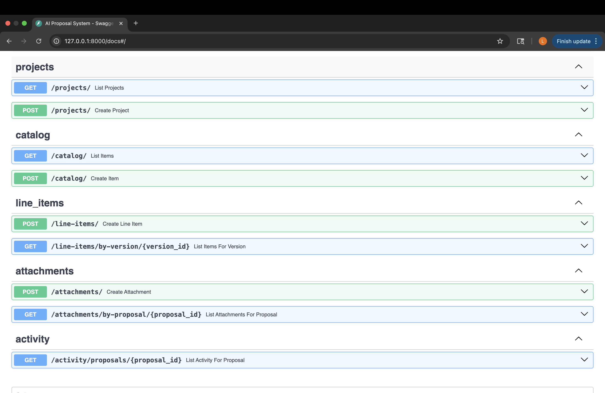

# ai-proposal-system - Final Report

## Summary
The AI Proposal System is a FastAPI + PostgreSQL backend that allows users to create clients, projects, proposals, proposal versions, and line items. The system models a real business workflow—specifically for landscaping or construction sales. It stores data persistently, supports concurrent access, and enables users to build and track multi-version proposals. Overall, the project demonstrates backend architecture, database modeling, REST API design, and scalability considerations.

## System Diagram
                ┌───────────────────────┐
                │        Client          │
                └───────────┬───────────┘
                            │ REST
                            ▼
               ┌────────────────────────┐
               │        FastAPI         │
               │  (Endpoints + CRUD)    │
               └───────────┬────────────┘
                           │ ORM
                           ▼
             ┌────────────────────────────┐
             │        SQLAlchemy          │
             │ Models + Relationships     │
             └───────────┬───────────────┘
                         │ SQL
                         ▼
             ┌────────────────────────────┐
             │         PostgreSQL         │
             │  Persistent Data Storage   │
             └────────────────────────────┘

## API Documentation
Below is a screenshot of the automatically generated FastAPI, Swagger UI, showing available endpoints:

## What did I learn? 
I learned how to:
	•	Build a modular FastAPI application using routers, models, and schemas.
	•	Test endpoints using Swagger UI and verify end-to-end functionality.
	•	Implement bidirectional relationships and cascading deletes in SQLAlchemy.
	•	Debug backend issues systematically by checking logs, database constraints, and model definitions.
	•	Understand how backend components (API → ORM → Database) fit together holistically.

## AI integration
I added an optional endpoint that uses OpenAI API to generate a summary for a proposal version. This could eventually be expanded to be an AI-assisted proposal generator.

## How I used AI
I used AI to help debug several SQLAlchemy issues, including:
	•	AmbiguousForeignKeysError
	•	Incorrect or mismatched back_populates names
	•	Typos such as propposal_id instead of proposal_id
	•	Relationship loops and missing foreign_keys=[] definitions

AI helped identify exactly which model or relationship was incorrect and explained why SQLAlchemy behaved the way it did.
It also helped me reason about the best structure for the system and improve my database design.

## Interest to me
This project is meaningful to me because my dad owns a construction company and my husband owns a landscaping company. I’ve seen firsthand how confusing proposal documents can be for homeowners, especially when they don’t understand the pricing.

The AI summarization feature helps customers clearly understand:
	•	What they’re paying for
	•	What’s included
	•	What the project actually consists of

Additionally, the activity logs help improve employee accountability and reduce confusion on the business side.

## Scaling, Performance, Reliability
Scaling characteristics include FastAPI handles thousands of requests per second and SQLAlchemy manages efficient reas and writes, but there is no caching layer so all reads hit the database which is slower at scale. Failover Strategy include SQLite offers local persistence but no replication and FastAPI itself is stateless and could be scaled horizontally behind a load balancer. 

